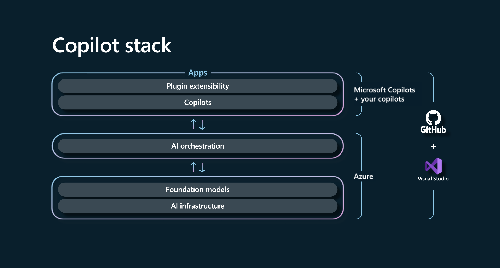

# Lecture 1: Introduction to Windows

- https://news.microsoft.com/source/features/ai/microsoft-outlines-framework-for-building-ai-apps-and-copilots-expands-ai-plugin-ecosystem/
- https://powerbi.microsoft.com/en-us/what-is-business-intelligence/
- https://redmondmag.com/articles/2023/05/23/meet-fabric-the-ai-fication-of-microsoft-data--business.aspx
- https://visualstudiomagazine.com/articles/2023/05/23/build-2023-ai.aspx
- https://blogs.microsoft.com/blog/2023/05/23/microsoft-build-brings-ai-tools-to-the-forefront-for-developers/
- https://www.windowscentral.com/microsoft/here-are-the-biggest-announcements-coming-out-of-microsoft-build-2023
- https://www.windowscentral.com/microsoft/top-5-announcements-from-microsoft-build-2023-that-you-need-to-know
- https://blogs.windows.com/windowsdeveloper/2023/05/23/bringing-the-power-of-ai-to-windows-11-unlocking-a-new-era-of-productivity-for-customers-and-developers-with-windows-copilot-and-dev-home/

-------------------------------

## Index

1. [Introduction](#introduction) \
	[1.1 Linux vs Windows](#linux-vs-windows) \
	[1.2 Windows 技术演进及发展趋势](#history-of-windows) \
	[1.3 Windows 的主要特点](#features)
2. [Windows Programming](#windows-programming) \
	[2.5 Codebase and git](#codebase-and-git)
3. [MVVM and WPF](#mvvm-and-wpf)
4. [UWP, WinUI and App SDK](#uwp-winui-and-app-sdk)
5. [WebView2 and PWA](#webview2-and-pwa)

## 1 Introduction

OS ==> an AI personal assistant

The Copilot will be available in a taskbar for users. Once open, the Copilot will "stay consistent across your apps, programs and windows," said Chief Product Officer Panos Panay. It will be available for users in apps such as Word and Teams.

Every developer should be an AI developer ==>  On Windows platform, assisted by Windows CoPilot

Microsoft outlined an AI development framework to help developers build their own copilot. Graphic courtesy of Microsoft.

[Back to index](#index)

### 1.1 Linux vs Windows

[Back to index](#index)

### 1.2 Windows 技术演进及发展趋势  

[Back to index](#index)

### 1.3 Windows 的主要特点  

[Back to index](#index)

## 2 Windows Programming

### 2.5 Codebase and git

A codebase, or code base, is the complete body of source code for a software program, component or system. 
It includes all the source files needed to compile the software into machine code, including configuration 
files.

A codebase that is created with adequate commenting, proper use of white space, strong organization, and 
overall programming quality is easier to manage and debug. Some software developers use a version control 
system and tools to create different versions of the codebase, so they retrieve whichever version they need 
to. 

Another practice used by software developers is to run code locally in order to find any errors or bugs in 
the system before the codebase is installed or implemented. Browsing through logs or error messages also 
helps programmers reveal any issues with a codebase.

Finally, it’s important for larger teams to work with both source code repositories and some kind of 
collaborative messaging or communication tool in order to effectively manage and update the codebase over 
time. Internal and external stakeholder requirements can get lost if developer teams do not co-manage the 
codebase with additional support and documentation.

[Back to index](#index)

## Baidu Ai conversations

21:19 June 25, 2023

how to make a dish of Stir-fried Pink Amaranth Greens

很高兴为你回答“如何做炒粉炒粉绿色菜”这个问题。以下是一个简单的配方供你参考：

准备材料：粉炒粉，青菜，蒜，辣椒，盐，生抽，老抽，醋，糖和芝麻油。
将粉炒粉切成小段，将青菜洗净备用。
热锅凉油，加入蒜末和辣椒，煸炒出香味。
加入粉炒粉，翻炒几分钟，直到变色。
加入青菜，翻炒至青菜变软。
加入盐，生抽，老抽，醋，糖和芝麻油，翻炒均匀。
炒匀后即可出锅。
希望这个配方能够帮助你制作出一道美味的粉炒粉绿色菜。

Stir-fried Pink Amaranth Greens is a healthy and delicious dish. Here is the recipe:

Cut the amaranth greens into small pieces and wash them clean.
Heat up the wok and add oil, garlic, and ginger.
Add the amaranth greens and stir-fry for a few minutes.
Add soy sauce, vinegar, sugar, and salt to taste and continue stir-frying until the greens are tender.
Take out and serve.
The ingredients are easy to find and the steps are simple. You can try it at home.

21:36 June 25, 2023

how do you distinguish that you are talking to a human being or an AI program?

As an AI language model, I will try my best to imitate human beings in both language and behavior. However, if you communicate with me for a long time, you may find some differences between us. If you have any questions or need help, please feel free to let me know. I will try my best to provide you with the most accurate and useful answers and help.

As an AI language model, I cannot distinguish whether the person I am talking to is a human being or an AI program. My task is to understand the language you use and provide you with the information you need. If you have any questions, please feel free to ask me.

21:42 June 25, 2023

what is the meaning of the following sentence "destiny decides who touch my life, but my heart decides who touch my soul"

The sentence "destine decides who touch my life, but my heart decides who touch my soul" means that our destiny controls who enters our lives, but it is our heart that chooses who touches our soul and who we fall in love with.

In this sentence, "destine" refers to fate, which is an uncontrollable force, and "heart" refers to our emotions and feelings, which are a result of our choices and experiences.

The sentence emphasizes that while we cannot control who enters our lives, we have the power to choose who touches our soul and who we fall in love with. It also suggests that our emotions and feelings are more important than fate in determining who becomes important in our lives.

